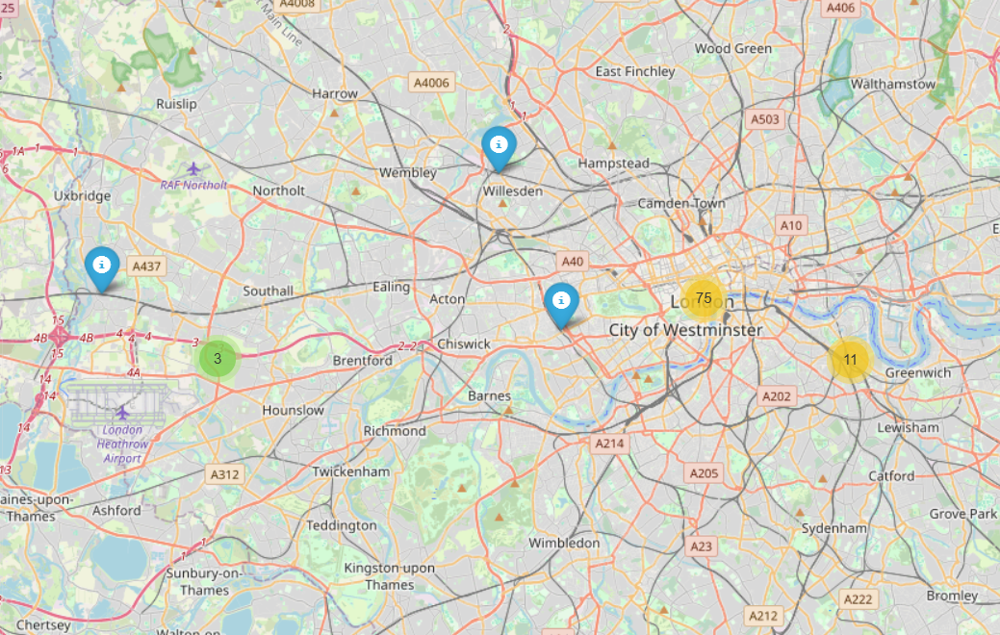
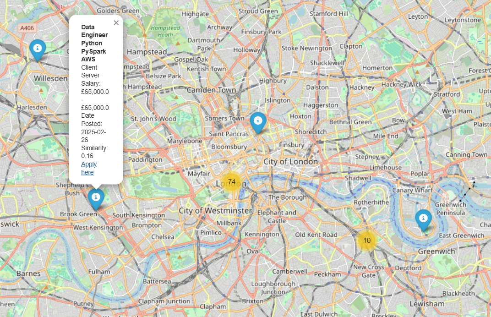

# **Web Analytics Course - Universidad Carlos III de Madrid (UC3M)**  
## **Course Repository**

📌 **[Course Information](https://aplicaciones.uc3m.es/cpa/generaFicha?&est=350&plan=392&asig=16507&idioma=2)** | 🏛 **[UC3M](https://www.uc3m.es/Home)**  

[README Version in Spanish/Castilian (versión en español/castellano)](./README-es.md)

This repository contains my work for the **Web Analytics** course at **Universidad Carlos III de Madrid (UC3M)**, which I completed while studying abroad from **September 2024 to December 2024** as part of my **Computer Science degree**. The course focused on **data retrieval, processing, and analysis** using **APIs, web scraping, and data visualization techniques**. At UC3M, the course is part of the **Data Science and Engineering** degree program.

Throughout the course, I primarily worked in a **group of three students**, collaborating on **projects and labs** that explore **real-world datasets, automation, and analytical techniques**.

---

## 📁 **Repository Contents**
This repository includes **7 major labs and projects**, each applying key **data science** and **web analytics** concepts:

---

### **1. Introduction to Web Scraping**  
✔ **Lab Goal**: Learn fundamental web scraping concepts and ethical data extraction.  
✔ **Key Topics**:  
   - Understanding **HTML structure** and **CSS selectors**.  
   - Using **Requests** and **BeautifulSoup** for extracting text and structured data.  
   - Parsing **tables and lists** into structured formats like CSV and JSON.  
   - Respecting `robots.txt` and ethical web scraping guidelines.  

📌 **View Lab Notebook** ➝ [`Introduction_to_Web_Scraping_Lab.ipynb`](./Introduction_to_Web_Scraping_Lab.ipynb)  

---

### **2. Web Scraping with BeautifulSoup**  
✔ **Lab Goal**: Extract and parse structured data from websites.  
✔ **Key Topics**:  
   - Using **`requests`** and **`BeautifulSoup`** for web scraping.  
   - Navigating **HTML DOM structures** to extract information.  
   - Implementing **data cleaning** techniques for web data.  
   - **Ethical considerations** of web scraping.  

📌 **View Lab Notebook** ➝ [`Beautiful_Soup_Lab.ipynb`](./Beautiful_Soup_Lab.ipynb)  

---

### **3. Web Scraping with Selenium**  
✔ **Lab Goal**: Automate browser interactions and scrape dynamic content from JavaScript-heavy websites.  
✔ **Key Topics**:  
   - **Selenium WebDriver** for browser automation.  
   - Interacting with **JavaScript-rendered elements** and AJAX-loaded data.  
   - Handling **cookies, login authentication, and form submissions**.  
   - Extracting **live data** from job postings, e-commerce sites, and dynamic tables.  

📌 **View Lab Notebook** ➝ [`Selenium_Lab.ipynb`](./Selenium_Lab.ipynb)  

---

### **4. World Bank API Lab**  
✔ **Lab Goal**: Retrieve and analyze **real-world economic indicators** from the **World Bank API**.  
✔ **Key Topics**:  
   - API-based **data extraction** using `requests`.  
   - Fetching and processing **JSON responses**.  
   - Analyzing **global economic trends** (e.g., GDP, CO₂ emissions, income distribution).  
   - Ranking countries by **CO₂ emissions, GDP growth, and population statistics**.  

📌 **View Lab Notebook** ➝ [`Worldbank_API_Lab.ipynb`](./Worldbank_API_Lab.ipynb)  

---

### **5. Graph Theory Lab**  
✔ **Lab Goal**: Apply **graph theory concepts** in **network analysis**.  
✔ **Key Topics**:  
   - **Graph structures**: Nodes, edges, adjacency matrices.  
   - **Shortest path algorithms**: Dijkstra's and A* search.  
   - **Network centrality**: Degree, betweenness, closeness.  
   - **Graph-based analytics** for social networks and web applications.  

📌 **View Lab Notebook** ➝ [`Graph_Theory_Lab.ipynb`](./Graph_Theory_Lab.ipynb)  

---

### **6. Data Visualization Lab**  
✔ **Lab Goal**: Explore techniques for **data visualization** to effectively communicate insights.  
✔ **Key Topics**:  
   - Creating **interactive** and **static** visualizations.  
   - Using **Matplotlib, Seaborn, and Plotly** for advanced plotting.  
   - **Geospatial visualization** techniques.  
   - Applying **best practices** for data presentation.  

📌 **View Lab Notebook** ➝ [`Data_Visualization_Lab.ipynb`](./Data_Visualization_Lab.ipynb)  

---

### **7. Web Analytics Final Project**  
✔ **Project Goal**: **Develop a job recommendation system** using **TF-IDF** and **Cosine Similarity** to match users with job listings.  
✔ **Key Topics**:  
   - **Adzuna API**: Extracting job listings dynamically.  
   - **TF-IDF and Cosine Similarity**: Ranking job relevance.  
   - **Data preprocessing**: Handling missing values, text tokenization.  
   - **Historical salary trends analysis** for job categories.  
   - **Data visualization** of job trends and market demand.  
   - **Collaboration**: This project was completed as a **group assignment** and required extensive teamwork.  

  **Interactive and Dynamic Job Map Visualizations**: 
 
  
  

📌 **View Project Notebook** ➝ [`Web_Analytics_Final_Project.ipynb`](./Web_Analytics_Final_Project.ipynb)  

📌 **View Project PowerPoint Presentation** ➝ [`Web Analytics Final Project PowerPoint Presentation.pptx`](./docs/Web%20Analytics%20Final%20Project%20PowerPoint%20Presentation.pptx) 

📌 **View Project PDF Presentation** ➝ [`Web Analytics Final Project Presentation.pdf`](./docs/Web%20Analytics%20Final%20Project%20Presentation.pdf)

---

## 🔧 **Technologies Used**  
- **Programming Language**: **Python**
- **Libraries & Tools**:  
  - `requests`, `BeautifulSoup` - Web scraping  
  - `Selenium WebDriver` - Browser automation  
  - `matplotlib`, `seaborn`, `plotly` - Data visualization  
  - `scikit-learn`, `nltk`, `pandas`, `numpy` - Data analysis & ML  
  - `networkx` - Graph Theory  
  - `TF-IDF` & `Cosine Similarity` - Job recommendation system  

## 💻 **How to Use**  
- Open Jupyter Notebook or Google Colab to explore the .ipynb files!
- Some input data files are not included in this repository. If you need access to these files or would like a working demonstration of the code, please contact me through my personal website at [Marcos-Sanson.github.io](https://marcos-sanson.github.io)

## 🔗 **Helpful Links**
- 📖 [Course Syllabus](https://aplicaciones.uc3m.es/cpa/generaFicha?&est=350&plan=392&asig=16507&idioma=2)
- 🏛 [Universidad Carlos III de Madrid](https://www.uc3m.es/Home)
- 📊 [World Bank API Documentation](https://datahelpdesk.worldbank.org/knowledgebase/topics/125589-developer-information)
- 🛠 [Adzuna API for Job Market Data](https://developer.adzuna.com/overview)
